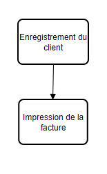
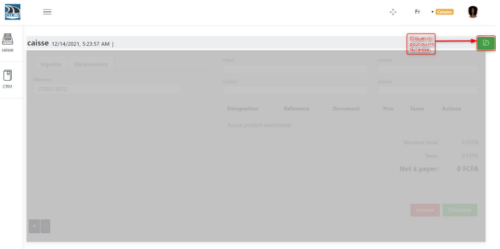
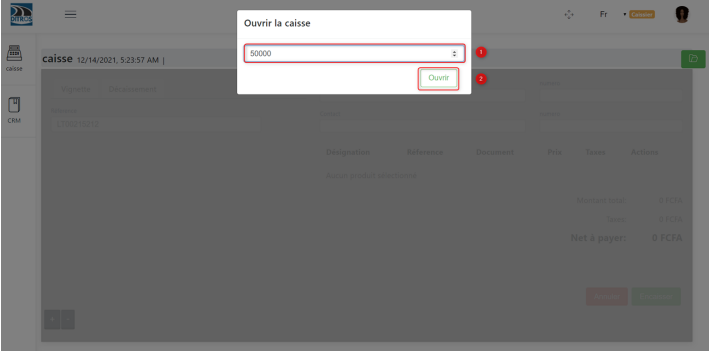
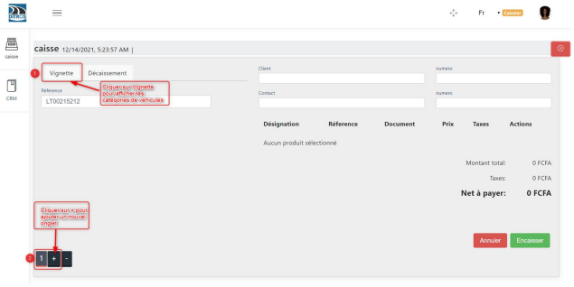
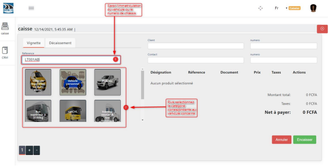
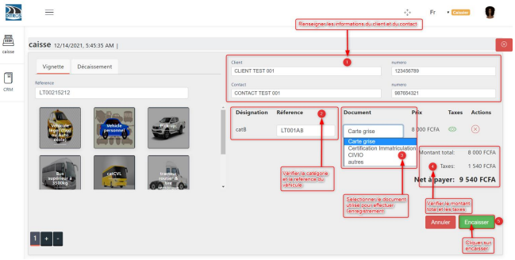
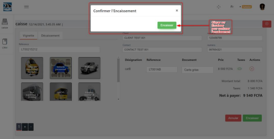
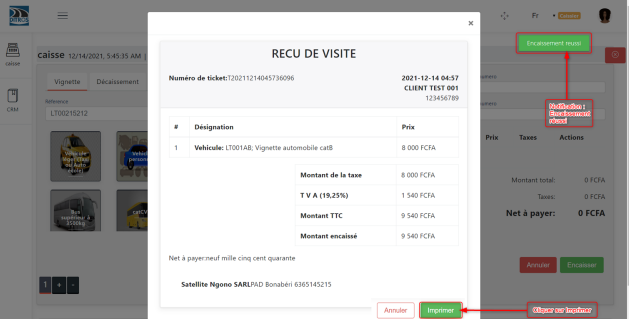

Customer Payment
++++++++++++++++

The figure below shows the different steps to follow to complete a customer payment.

.. centered:: Steps for payment

As a prerequisite, you must first be logged in with the cash desk role to be able to perform the following operations.

Customer Registration
=====================

The steps to register a customer are:

* **Opening the cash register**

Once logged into an account with the cash desk role, you must **open the cash register** by entering the initial amount in possession at the time when you start the entries.

.. centered:: Open the cash register

Enter the initial amount in the cash register at the time of opening.

.. centered:: Enter the amount in the cash register

Once the cash register is open, this interface will appear before starting the entries. 
You need to display the vehicle categories and add a tab.

.. centered:: Select vehicle category

* Fill in the fields

Fill in the following fields using the vehicle registration document:

➢ Reference

➢ Select the corresponding vehicle category icon

➢ Customer

➢ Customer phone number

➢ Contact

➢ Contact phone number

➢ Choose the type of document to complete the registration

  * Vehicle registration document
  * Registration certificate
  * CIVIO
  * Other document

After filling in the fields, click on **“Cash In”**. The figures below clearly illustrate the process.

.. centered:: Enter vehicle and customer information

.. centered:: Enter vehicle and customer information

Then, we must confirm the payment.

.. centered:: Confirm payment

Invoice Printing
================

* Print the payment receipt

Right after the customer has been cashed in, you need to print their invoice.
Indeed, once the payment is made, you will receive a notification **“Payment successful”**. You can now print the payment receipt.

.. centered:: Print the invoice

* Re-print the payment receipt

To reprint the payment receipt, you must:
    
  * **(1)** Select the registered vehicle
  * **(2)** Click on **“Reprint payment receipt”** to print the receipt.
