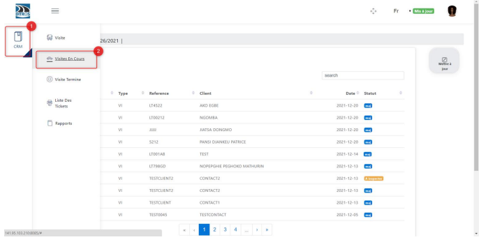
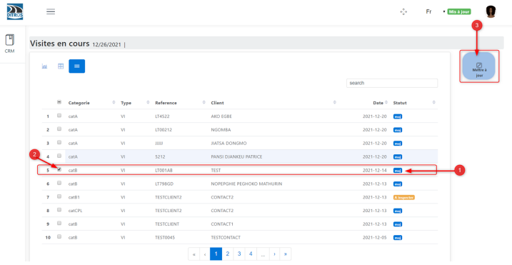
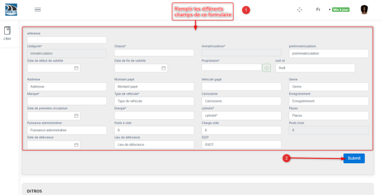

Vehicle Registration Document Entry
+++++++++++++++++++++++++++++++++++

To proceed with the entry of the vehicle registration document, you must first have the necessary role (vehicle registration document update). Then, follow these steps:

* **Refresh the inspection list**

To do this:

    #. Click on **“CRM”**
    #. Click on **“Ongoing Visits”**
    #. The vehicle you have registered will appear in the inspection list with the status **Update**
    #. Select the previously registered vehicle
    #. Click on **“Update”**

.. centered:: Ongoing visits list

.. centered:: Vehicle to be updated

* **Fill in the registration certificate information**

Then fill in the following fields as specified on the vehicle's registration document:

➢ Chassis number*

➢ Previous registration*

➢ Certificate validity start date*

➢ Certificate validity end date*

➢ Owner*

➢ SSDT ID*

➢ Address*

➢ Amount paid*

➢ Mortgaged vehicle*

➢ Vehicle type*

➢ Brand*

➢ Vehicle category*

➢ Bodywork*

➢ Registration number*

➢ D.M.C*

➢ Fuel type*

➢ Engine displacement*

➢ Seating capacity*

➢ Administrative power*

➢ Unladen weight*

➢ Payload*

➢ Total weight*

➢ Date of issue*

➢ Place of issue*

➢ SSDT center*

After filling in the fields, click on **“Submit”**.

.. centered:: Confirmation of vehicle registration document information

**Note:** Filling in the fields ending with **an asterisk (*)** is **mandatory.**
