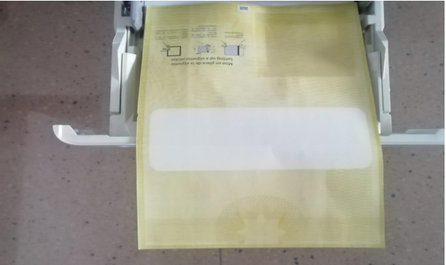
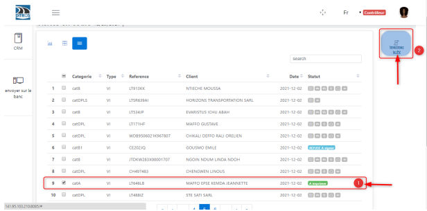
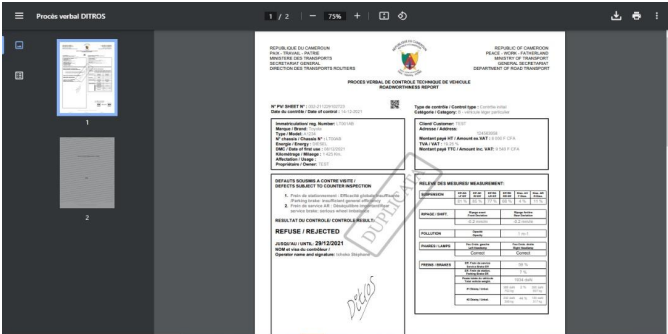

Report Printing
+++++++++++++++

To print a report, you must have the role of **“Operations Manager”**. After this, two scenarios are presented:

**1.** The Report is Approved
******************************

In this case, follow these steps:

* Insert the yellow report paper into the printer according to the orientation below:

.. centered:: Physical support of the report

* Click on **“CRM”** and then on **“Ongoing Visits”**.

.. image:: ../img/listeVisites.PNG
    :align: center
    :name: Ongoing visits list
.. centered:: Ongoing visits list

* **(1)** Select the vehicle for which you want to print the report.
* **(2)** Click on the **“Print Report”** button.

.. centered:: Report printing

* The following interface will be displayed.

.. centered:: Final report

* Simultaneously press the **“Ctrl”** and **“P”** keys to start printing.

**2.** The Report is Rejected
******************************

In this case, follow these steps:

* Insert a standard A4 sheet into the printer.
* Click on **“CRM”** and then on **“Ongoing Visits”**.

.. image:: ../img/listeVisites.PNG
    :align: center
    :name: Ongoing visits list
.. centered:: Ongoing visits list

* **(1)** Select the vehicle for which you want to print the report.
* **(2)** Click on the **“Print Report”** button.

.. centered:: Report printing

* The following interface will be displayed.

.. centered:: Final report

* Simultaneously press the **“Ctrl”** and **“P”** keys to start printing.
