Vehicle Inspection
++++++++++++++++++

The inspection of a vehicle goes through four steps illustrated in the figure below:

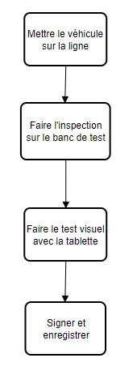
.. centered:: Inspection Steps

**NOTE:** During the Technical Inspection process, the inspector will use two interfaces of the DITROS CT application for their operations:

* **The web interface:** through which they will assign the vehicle to a test line and sign at the end of the inspection.

* **The mobile interface:** through which they will take photos and record the vehicle's visual defects.

First, log in to the Web interface with an account having the inspector's rights as follows:

* **Open a browser on the tablet** (preferably Firefox or Google Chrome)

.. image:: ../img/navigateur.jpg
    :align: center
    :name: Firefox or Google Chrome Icon
.. centered:: Firefox or Google Chrome Icon

* **Enter the server IP address in the browser's search bar**: In the search bar, enter the server's IP address. In our case, it is the address **“51.195.11.202:8098”** as shown by **1**. Then confirm as in **2**.

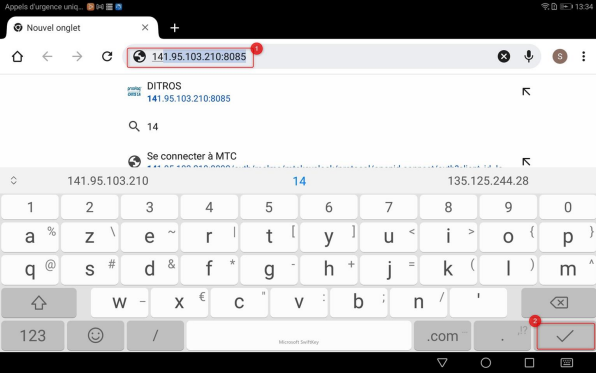
.. centered:: Connecting to the application

* **Enter your login credentials** (username and password): You will see a login interface. Enter your login credentials:

  * Your username
  * Your password
  * Click on **“Login”**.

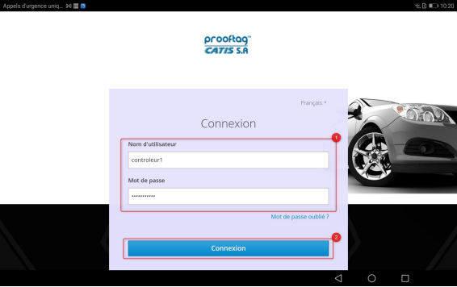
.. centered:: Identification

**Note:** You must have the **inspector role** to proceed further.

Once authenticated, we can move on to the first step of the process.

Vehicle on the Line
===================

We will begin this step by clicking on the **“send to test bench”** button as shown below:

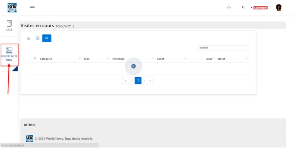
.. centered:: Sending to the test bench initialization

#. Verify the vehicle's registration in the relevant list.
#. By default, the vehicle located at the top left of the list is selected for inspection. To inspect another vehicle, select the icon with the registration number of the vehicle concerned.
#. The registration of the selected vehicle is displayed on the right side of the interface.
#. **Fill in the inspection form fields**, which include:

    ⮚ The line to which the vehicle will be assigned*,

    ⮚ The number of axles*,

    ⮚ The chassis number*,

    ⮚ The mileage*,

    ⮚ And the axle brakes*

    **Note:** The test line you choose in the **“used line”** field is the one you will use for the vehicle's technical inspection on the bench. If you choose the **wrong line**, the technical inspection cannot be completed successfully.

#. Then click on **“Submit”**.

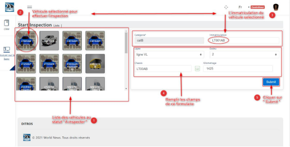
.. centered:: Selecting the vehicle to send to the test bench

Once validated, you will see the following interface showing the various tests to be performed on the bench(s) of the line to which you have assigned the vehicle.

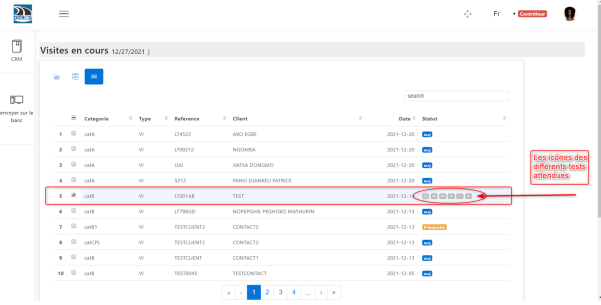
.. centered:: Tests to be performed

**Good to know:** Semantics of the different test icons displayed on the DITROS CT application.

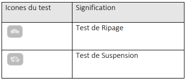
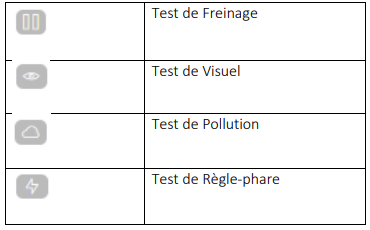
.. centered:: Icon semantics

Test Bench
==========

When the different tests to be performed are displayed on the DITROS CT application, the inspector must go to the test bench of the line chosen earlier and select the relevant registration number. Then they will start the actual vehicle inspection.

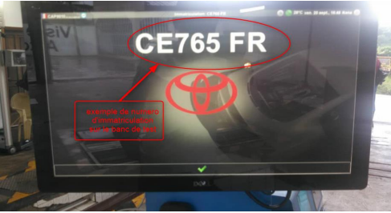
.. centered:: Example of an inspection equipment dashboard

After completing the inspection on the test bench, the inspector transmits the test results to the server by clicking the appropriate data transmission button.

**The data transmission button depends on the manufacturer and the software used on the test bench.**

**Note:** These transmitted details will be visible in the **“Ongoing Visits”** interface of DITROS CT.

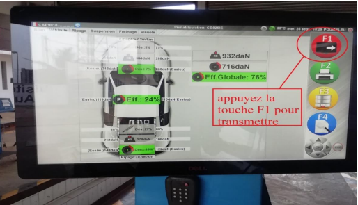
.. centered:: Transmitting information to DISTRO CT

Visual Inspection
=================

Once the vehicle inspection has been completed on the test bench, the inspector connects to the DITROS CT mobile application to conduct visual tests, which involve recording visual defects and taking photos of the vehicle. To do this:

* **Open the DITROS application on the tablet:** click on the application icon located in the tablet menu.

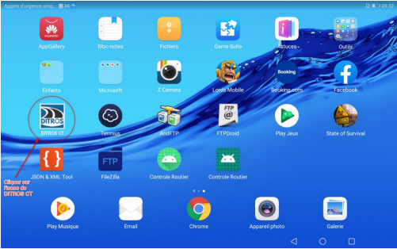
.. centered:: DISTRO CT Icon

* **Select the inspector's ID performing the tests on the displayed drop-down connection interface**
  * **(1)** tap the proposed form field

  .. image:: ../img/select.PNG
    :align: center

  * **(2)** select your ID from the drop-down list

  .. image:: ../img/choixIdentifiant.PNG
    :align: center

  * **(3)** enter the password and press **“login”**

  .. image:: ../img/Loging.PNG
    :align: center

  * **(4)** Select the concerned line

  .. image:: ../img/choixLigne.PNG
    :align: center

  * **(5)** Select the vehicle registration in progress and validate as follows:

  .. image:: ../img/test_validation.PNG
    :align: center

  * In the main visual inspection interface:

    * Verify the vehicle registration
    * Easily search for observed defects in the list, select, and visualize the chosen defects
    * Fill in the headlight ruler and gas analyzer data
    * Take photos and preview them
    * Once all information is entered, confirm by clicking the button as follows:

  .. image:: ../img/detailsIHM.PNG
    :align: center

  * **Taking photos on the tablet**

Before taking photos, first ensure that the registration number displayed on the tablet matches the one you want to inspect. To take photos of the vehicle, click on the camera icon located at the bottom right of the tablet interface.

  .. image:: ../img/prisePhoto.PNG
    :align: center

  * **Good to know:** Before taking photos, the status is **“No Picture”** as follows:

  .. image:: ../img/statutPhoto.PNG
    :align: center

  * Click on the icon to capture the image as shown below:

  .. image:: ../img/photoVoiture1.PNG
    :align: center

  * Click on the icon to validate the photo as shown below:

  .. image:: ../img/photoVoiture2.PNG
    :align: center
    :name: Photo preview
  .. centered:: Photo preview

After taking the photos, the photo section should look like this. Ensure that the status has changed from **“No picture”** to **“image 1”** and **“image 2”**.

* **Record visual defects**

  .. image:: ../img/defautsVisuels.PNG
    :align: center
    :name: Selecting visual defects
  .. centered:: Selecting visual defects

  * Click respectively on buttons **(1)** & **(2)** to enter the measured values.

  .. image:: ../img/polution_phare.PNG
    :align: center
    :name: Pollution and Headlights
  .. centered:: Pollution and Headlights

  * **(1)** Enter the gas analyzer measurements and click on **“submit”**

  .. image:: ../img/polution.PNG
    :align: center
    :name: Pollution rate measurement
  .. centered:: Pollution rate measurement

  * **(2)** Select the headlight ruler values and click on **“submit”**

  .. image:: ../img/mesurePhare1.PNG
    :align: center
  .. image:: ../img/mesurePhare2.PNG
    :align: center
    :name: Headlight level
  .. centered:: Headlight level

**IMPORTANT:** It is important to note that data automatically recorded by the GIEGLAN protocol for heavy-duty vehicles (skid and brake) and light vehicles (skid, suspension, and brake) should not be manually entered on the tablet. They are automatically generated.

**Note:**

**(1)** Once the visual tests are completed, the inspector transmits the data to the server.

**(2)** The color of the test icons changes gradually after the Gieglan files are processed.

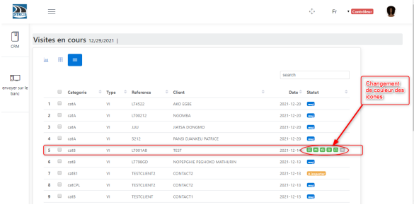
.. centered:: Icon color change

Signature and Recording
=======================

On the tablet, return to the web application. The tests have been completed, and thus the status is **“To be signed”**.

**(1)** Select the vehicle for which the tests have been completed and whose status is **“To be signed”**.

**(2)** Then click on the **“Sign the report”** button.

* **1st case: “Inspection REFUSED”**

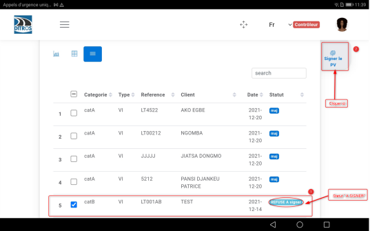
.. centered:: Inspection refused

* **2nd case: “Inspection APPROVED”**

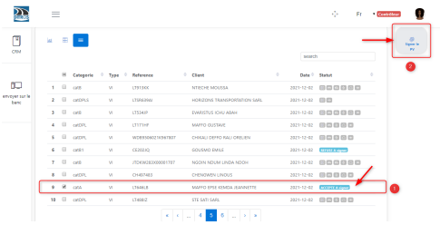
.. centered:: Inspection approved

**(3)** Click on **“Sign the report”** to access the inspector's signature interface. Sign and click on **“Save”**.

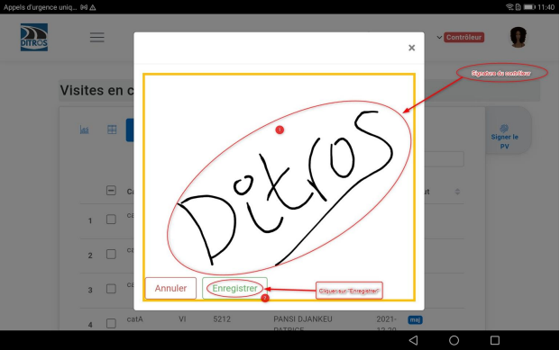
.. centered:: Inspector's signature space

**(4)** Once the recording is complete, you receive a **“signature ok”** notification.

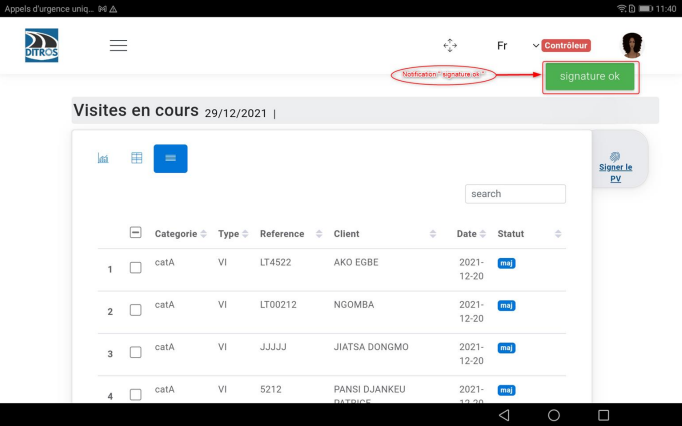
.. centered:: Signature confirmation
