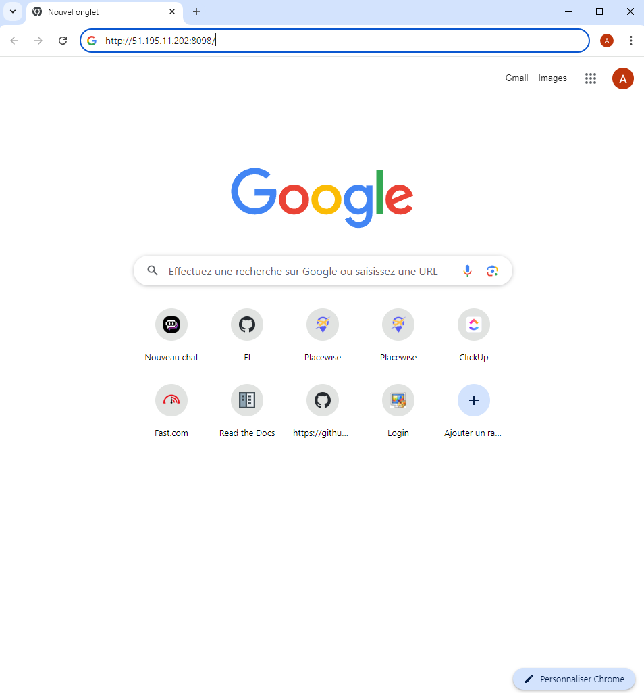
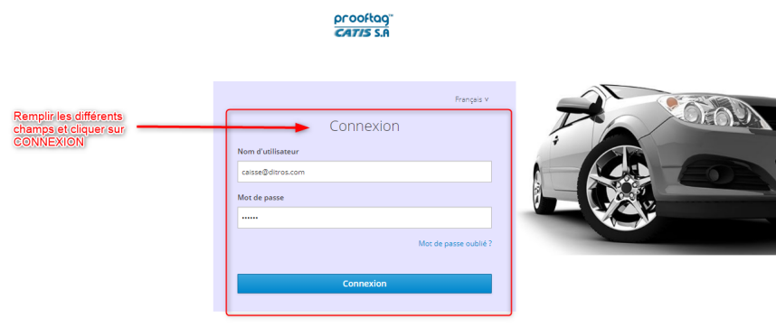

Connecting to the Application
+++++++++++++++++++++++++++++

Open a browser on your computer
It is recommended to use either Firefox or Google Chrome browsers.

.. centered:: Firefox or Google Chrome Icon

.. centered:: Enter the address

Enter the server IP address in the browser's search bar

In the search bar, enter the server's IP address. In our case, it is the address "51.195.11.202:8098". Then press the "Enter" key on your keyboard:

On the interface that appears, enter your login credentials:

* Your username
* Your password

Then click on **"LOGIN".**

.. centered:: DITROS CT Application Login Interface
