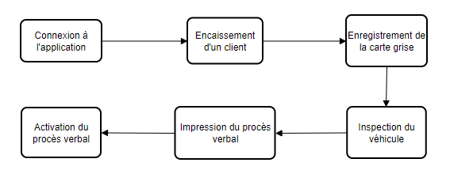
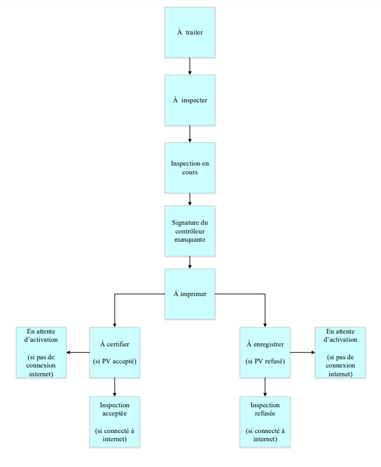

Prerequisites
+++++++++++++

Activity Diagram of the Process
===============================

The diagram below shows the different steps involved in establishing an Inspection Report (IR) for an initial inspection.

.. centered:: Activity Diagram of the Process

Before starting the process, always ensure that the server, the test bench, the computer you will connect to, and the tablet are all on the same network (wired or Wi-Fi).

Vehicle State-Transition Diagram
================================

It is also important to know the different statuses that vehicles registered on the application will go through.

.. centered:: Vehicle State-Transition Diagram

The table below explains the semantics of the statuses:

.. list-table:: Vehicle Statuses
    :align: center
    :header-rows: 1
    :class: fixed-width-table

    * - **Status**
      - **Meaning**
    * - 1 **To be processed**
      - The vehicle is already registered at the cashier; the account responsible for entering vehicle registration information must **enter the registration information.**
    * - 2 **To be inspected**
      - The registration information has already been entered; the inspector must **begin the vehicle inspection.**
    * - 3 **Inspection in progress**
      - This status occurs when the inspector has already started the inspection on the tablet, and the vehicle must now undergo technical inspection on the corresponding test line.
    * - 4 **Controller's signature missing / To be signed**
      - **The inspector must sign the vehicle's technical inspection report.**
    * - 5 **To be printed**
      - The **inspection report must be printed** by operations.
    * - 6 **To be certified**
      -
    * - 7 **To be recorded**
      -
    * - 8 **Inspection accepted**
      -
    * - 9 **Inspection rejected**
      -
    * - 10 **Awaiting activation**
      -

To produce an Inspection Report up to its activation, follow the steps in the **PROCESS FOR OBTAINING AN INSPECTION REPORT** section.
